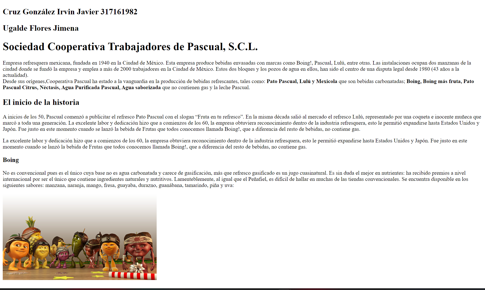
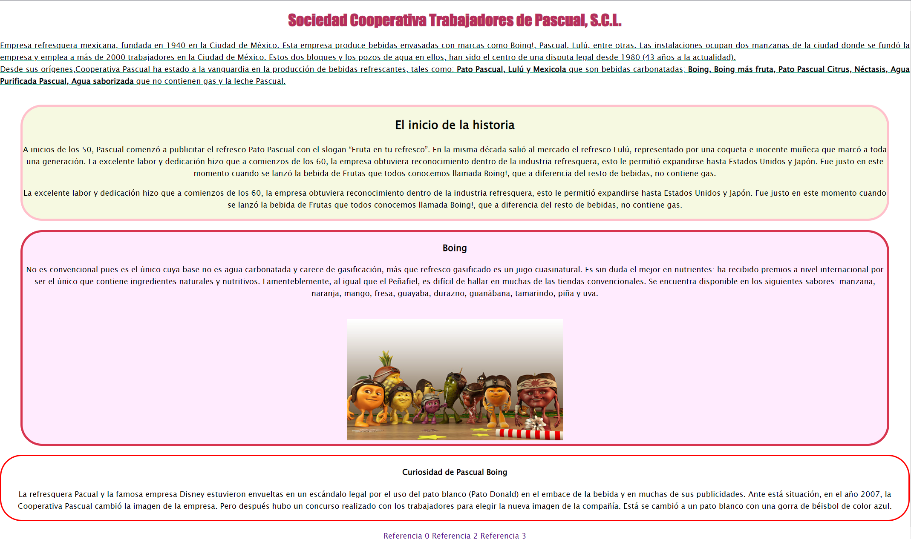

# Tarea corta 3 - CSS Básico

## Descripción

Tarea corta en donde se hace una extención de la tarea corta 01 "HTML básico" para agregarle estilos(CSS)

## Screenshots

## Autores
* Cruz González Irvin Javier
- Ugalde Flores Jimena (https://github.com/JimenaUgalde)