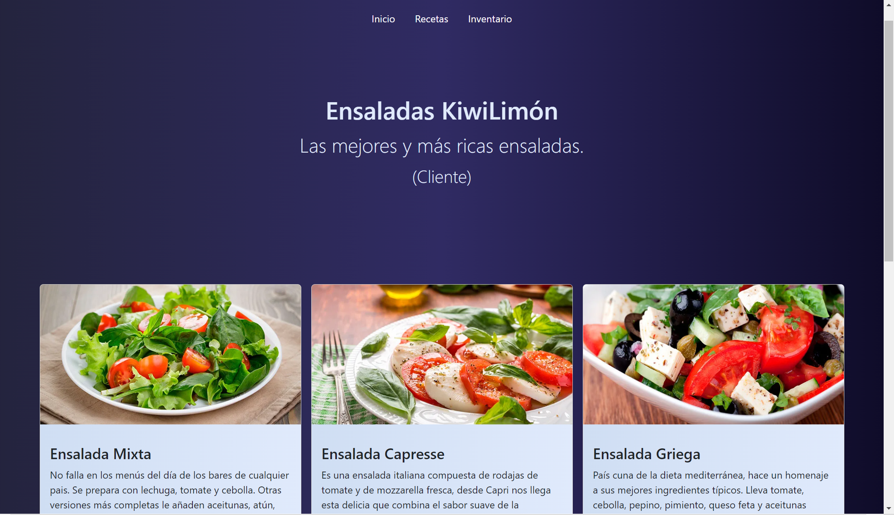
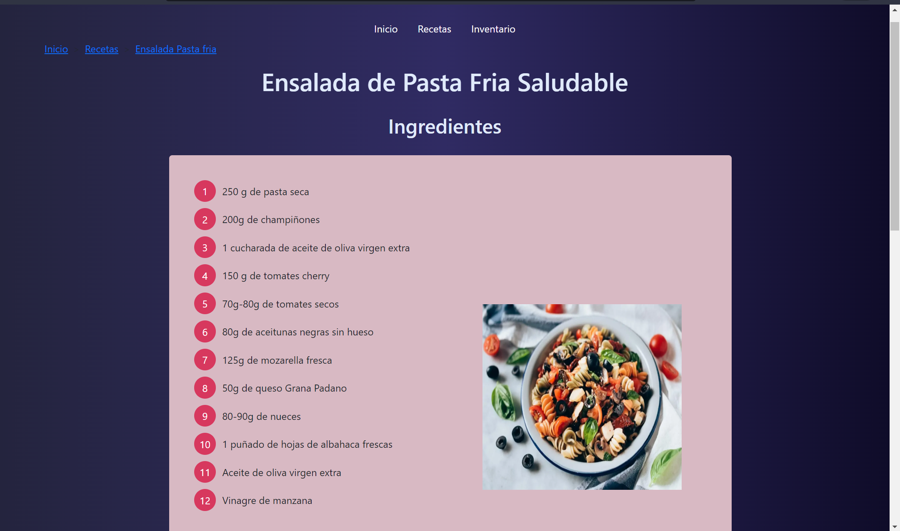

# Tarea 3 - Bootstrap

## Descripción

Tarea larga que se hace uso de HTML y Bootstrap para elaborar un sitio web  para una tienda de ensaladas.

## Screenshots

## Autores
* Cruz González Irvin Javier
* Ugalde Flores Jimena (https://github.com/JimenaUgalde)